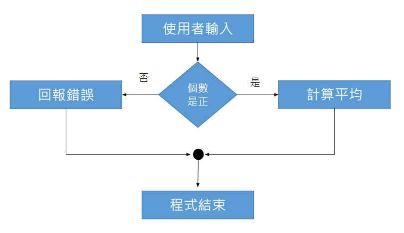

# if...else 如果有其他

## ****

.png>)

## **簡單範例**

```python
a = 200
b = 33
if b > a:
  print("b 大於 a")
else:
  print("b 小於等於 a")
```

## 實際範例



```python
print('計算平均的程式')
total = int(input('請輸入總和>'))
count = int(input('請輸入個數>'))
if count > 0:
	print('答案是',total/count)
else:
	print(‘無法計算---個數需為正整數')
```

## **格式規定：**縮排


會出錯！

```python
if count > 0:
print('答案是',total/count)
else:
print('無法計算---個數需為正',total/count)

# 輸出
expected an indented block
```



**內縮四格空白(一個Tab鍵)**

