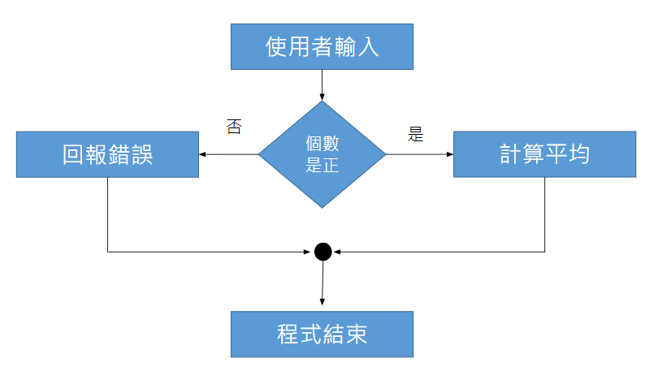

# if 美好的如果

## **if**

\*\*\*\*


```python
a = 33
b = 200
if b > a:
  print("b 大於 a")
```

#### **範例**

```python
print('計算平均的程式')
total = int(input('請輸入總和>'))
count = int(input('請輸入個數>'))
if count > 0:
	print('答案是',total/count)
```

## if...else **如果有其他**



```python
a = 200
b = 33
if b > a:
  print("b 大於 a")
else:
  print("b 小於等於 a")
```

## **格式規定：**縮排


會出錯！

```python
if count > 0:
print('答案是',total/count)
else:
print('無法計算---個數需為正',total/count)

# 輸出
expected an indented block
```



**內縮四格空白\(一個Tab鍵\)**


## **省略else**

**例子 : 買電影票**

```python
print('買電影票的程式')
identity = input('請輸入身份> ')
count = int(input('請輸入人數> '))

price = count*320#全票票價 

if identity == '學生':
	price = price*0.8#學生打八折

print('總價', int(price), '元')
```

```bash
# 執行 1

買電影票的程式
請輸入身份> 學生
請輸入人數> 10
總價 2560 元
```

```bash
# 執行 2

買電影票的程式
請輸入身份> 一般人
請輸入人數> 10
總價 3200 元
```

## if...elif...**else** **如果不只兩種可能**


```python
grade = int(input('你的年級 >'))
if grade == 1:
	print('一年級')
elif grade == 2:
	print('二年級')
elif grade == 3:
	print('三年級')
else:
	print('大大級')
```


