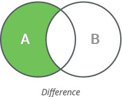

# 集合 Set

與數學上的集合類似，集合裡面所有元素只出現一次不重複，並且沒有順序，稱為**無序**

### 創造 Create

```python
s = {"apple", "banana", "cherry"}
print(s)
```

空 Set

```python
s = set()
print(s)
```

注意不是`s = {}` 因為使用`{}`將會創造出空字典，字典將於下一個環節教到

List 轉 Set

```python
l = [0, 1, 2, 3, 4]
s = set(l)
print(s)
```

### 檢查 Check

```python
s = {"apple", "banana", "cherry"}
print("banana" in s)
if "apple" in s:
    print("apple is in s")
```

### 新增 Add

一個元素用`add()`，多個元素用`update()`

```python
s = {"apple", "banana", "cherry"}
s.add("nuts")
print(s)
s.update(["orange", "mango"])
print(s)
```


若加入重複的元素則不會有反應，因為集合不重複！

```python
s = {"apple", "banana", "cherry"}
s.add("apple")
print(s)
```


### 取得 Access

不能讀取單一元素，因為 Set 沒有標籤，只能遍歷或檢查

### 遍歷 Loop Through

```python
s = {"apple", "banana", "cherry"}

for elem in s:
  print(elem)
```

### 長度 Length

```python
s = {"apple", "banana", "cherry"}
print(len(s))
```

### 移除 Remove

```python
s = {"apple", "banana", "cherry"}
s.remove("apple")
print(s)
s.discard("banana")
print(s)
```

### 清除 Clear

```python
s = {"foo", "bar", "baz"}
s.clear()
print(s)
```

### 刪除 Delete

```python
s = {"foo", "bar", "baz"}
del s
print(s)
```

### 聯集 Union\(OR\)


```python
s1 = {0, 1, 2}
s2 = {2, 3, 4}
s3 = s1.union(s2)
print(s3)
```

### 差集 Difference



```python
s1 = {0, 1, 2}
s2 = {2, 3, 4}
s12 = s1.difference(s2)
s21 = s2.difference(s1)
print(s12)
print(s21)
```

或

```python
s1 = {0, 1, 2}
s2 = {2, 3, 4}
s1.difference_update(s2)
print(s1)
```

### 交集 Intersection\(AND\)


```python
s1 = {0, 1, 2}
s2 = {2, 3, 4}
s3 = s1.intersection(s2)
print(s3)
```

或

```python
s1 = {0, 1, 2}
s2 = {2, 3, 4}
s1.intersection(s2)
print(s1)
```

### 對稱差集 Symmetric Difference\(XOR\)


```python
s1 = {0, 1, 2}
s2 = {2, 3, 4}
s3 = s1.symmetric_difference(s2)
print(s3)
```

### 不交集 Disjoint

```python
s1 = {0, 1, 2}
s2 = {2, 3, 4}
s3 = {"a", "b", "c"}
print(s1.isdisjoint(s2))
print(s1.isdisjoint(s3))

```

### 子集（包含於） Subset

```python
s1 = {0, 1, 2, 3, 4}
s2 = {0, 2, 4}
print(s2.issubset(s1))
print(s1.issubset(s2))
```

###  **父集（**包含） Upperset

```python
s1 = {0, 1, 2, 3, 4}
s2 = {0, 2, 4}
print(s2.issuperset(s1))
print(s1.issuperset(s2))
```

### 集合的運算子

```python
a = set('abracadabra')
b = set('alacazam')

print(a | b)                              # 聯集 
print(a - b)                              # 差集
print(a & b)                              # 交集
print(a ^ b)                              # 對稱差集
```

其他：僅供參考


| Operator | Description |
| :--- | :--- |
| A \| B A.union\(B\) | Returns a set which is the union of sets `A` and `B` |
| A \|= B A.update\(B\) | Adds all elements of array `B` to the set `A`. |
| A & B A.intersection\(B\) | Returns a set which is the intersection of sets `A` and `B`. |
| A &= B A.intersection\_update\(B\) | Leaves in the set `A` only items that belong to the set `B`. |
| A - B A.difference\(B\) | Returns the set difference of `A` and `B` \(the elements included in `A`, but not included in `B`\). |
| A -= B A.difference\_update\(B\) | Removes all elements of `B` from the set `A`. |
| A ^ B A.symmetric\_difference\(B\) | Returns the symmetric difference of sets `A` and `B` \(the elements belonging to either `A` or `B`, but not to both sets simultaneously\). |
| A ^= B A.symmetric\_difference\_update\(B\) | Writes in `A` the symmetric difference of sets `A` and `B`. |
| A &lt;= B A.issubset\(B\) | Returns `true` if `A` is a subset of `B`. |
| A &gt;= B A.issuperset\(B\) | Returns `true` if `B` is a subset of `A`. |
| A &lt; B | Equivalent to `A <= B and A != B` |
| A &gt; B | Equivalent to `A >= B and A != B` |

